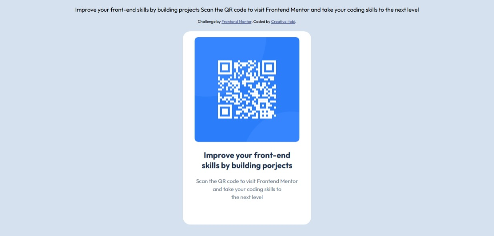

# Frontend Mentor - QR code component solution

This is a solution to the [QR code component challenge on Frontend Mentor](https://www.frontendmentor.io/challenges/qr-code-component-iux_sIO_H). Frontend Mentor challenges help you improve your coding skills by building realistic projects. 

## Table of contents

- [Overview](#overview)
  - [Screenshot](#screenshot)
  - [Links](#links)
  - [Built with](#built-with)
  - [What I learned](#what-i-learned)
- [Author](#author)

## Overview
The challenge is to build out this QR code component and getting it to look as close to the design as possible.

### Screenshot

### Links

- Solution URL: [https://creative-tobi.github.io/QR-CODE/](https://creative-tobi.github.io/QR-CODE/)
- Live Site URL: [https://qr-code-clone.netlify.app/)](https://qr-code-clone.netlify.app/)

### Built with

- HTML5 markup
- CSS custom properties
- Mobile-first workflow

### What I learned

While building this QR Code component, I learned:

- How to structure a basic HTML page
- Applying modern CSS layout techniques
- Using px for responsive spacing
- How to center content
- The importance of clean, semantic markup

## Author

- Website - [Creative-tobi](https://qr-code-clone.netlify.app/)
- Frontend Mentor - [@Creative-tobi](https://www.frontendmentor.io/profile/yourusername)
- Twitter - [@aisha15294](https://x.com/aish15294)

